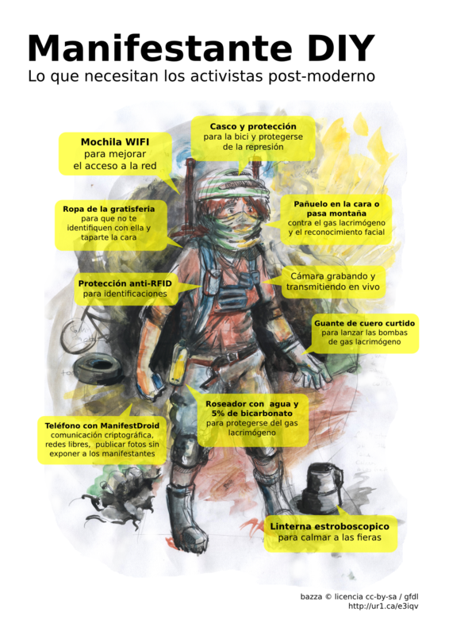

# Poster del manifestante del siglo XXI

Lo que necesita un activista del siglo XXI

## Detalles

* Casco y proteccion para la bici y protegerse de la represión
* Pañuelo en la cara o pasamontaña
  * Contra el [gas lacrimogeno](GAS.md)
  * Contra el [sistema BIOS](SIBIOS.md) o reconocimento de rostros
* Guante de cuero curtido, para sostener las bombas de gas lacrimógeno
* Ropa de la [gratisferia](Gratiferia.md) para que no te identifiquen con ella y taparte la cara
* Cámara grabando/transmitiendo en vivo
* Telefóno con [ManifiestDroid](manifiestdroid/)
 * Comunicación encritada (SMS, telefono, chat y voip)
 * Publicar fotos sin exponer a los manifestantes
* Botella con vinagre o jugo de limón: para protegerse del [gas lacrimógeno](GAS.md)
* Mochila con [router wifi](/b4zz4/NodoDeGuerrilla/) con [OpenWRT](https://openwrt.org/)
 * Antenas para transmitir con mayor potencia
* Linterna [estroboscopico](https://www.instructables.com/id/Stop-Time-with-an-LED-Stroboscope/?ALLSTEPS) de entre 5HZ a 7HZ para calmar a las fieras

## Quehaceres

* Hacer svg interactivo
 * exportar en pixelar
 * traducir
* barricada un hosteable
* Pasar articulos a markdown
 * Correjir enlaces
* Diagrama del estroboscopico con un 505
* Referencia a los italiano que se protegian de los policias
