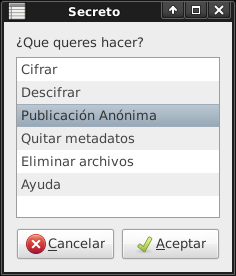

# Secreto

Este programa permite cifrar y descifrar mensaje o archivos para enviarlos por correo electrónico, publicarlo, compartir de modo anónimo. También nos permitirá guardar información de cualquier tipo dentro de una imagen o audio o generar códigos QR con el mensaje cifrado.

## Instalar

<pre>
cd /tmp
wget https://raw.github.com/b4zz4/ManifestanteXXI/master/bin/secreto
wget https://raw.github.com/b4zz4/ManifestanteXXI/master/bin/wgetpaste
chmod +x secreto
chmod +x wgetpaste
sudo cp wgetpaste /usr/bin/
./secreto -i
</pre>

Luego seguir los pasos de la instalación.
