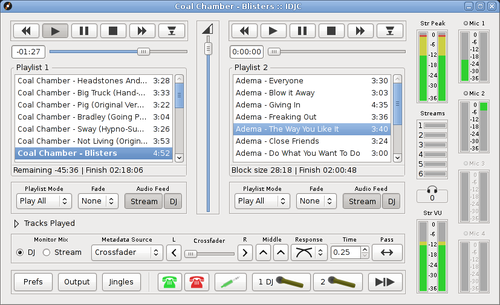
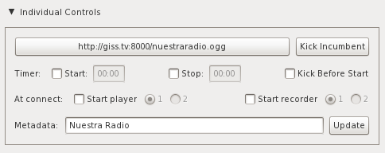
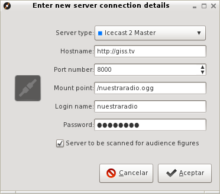
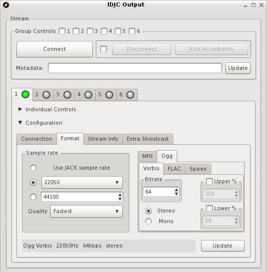
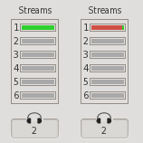

# Configuración servidores en IDJC
## Configurar la estación (Streaming)

**IDJC** es el operador de la radio que se conecta a un servidor de [streaming](Glosario.html#Streaming) para hacer la transmisión.

La configuración de servidores de streaming en [IDJC](Glosario.html#IDJC) se hace en la ventana de **"Salidas" (Output)**, al que se 
accede desde la ventana principal de **IDJC**. Para configurar el servidor de streaming al que **IDJC** se conecta primero hay que 
conocer los siguientes datos:

>**Servidor de streaming:** [http://giss.tv](http://giss.tv)
>
>**Número de puerto:** 8000
>
>**Punto de montaje (nombre de la radio):** /nuestraradio.ogg
>
>**Nombre de usuario:** nuestraradio
>
>**Contraseña:** hackeame

La unión de servidor, puerto y punto de montaje dan la dirección de la radio:
[http://giss.tv:8000/nuestraradio.ogg](http://giss.tv:8000/nuestraradio.ogg)

### Configuración en IDJC

En la ventana de "Salidas" hay seis solapas, cada una representando la configuración de seis 
tipos de salidas distintas. Cada una se configura para un tipo de streaming distinto, por ejemplo para distintas calidades de salida, y 
como mínimo deben tener un servidor de streaming al que conectarse (los demás sirven de backup). Para agregar un servidor, dentro de la 
sección **"Configuración" (Configuration)**, usar el botón **"Nuevo" (New)**

> Dejar los metadatos en blanco

Luego corresponde configurar el formato de salida. Si la colección de temas se encuentra en diferentes formatos, IDJC lo convierte todo 
al formato y calidad seleccionados. 

> Dentro de la ventana siguiente se escriben los datos del servidor.

Si bien se pueden seleccionar varios formatos, muchos servidores de streaming prefieren usar el formato libre [ogg](Glosario.html#Ogg), 
porque a diferencia de [mp3](https://es.wikipedia.org/wiki/MP3) no está [restringido por 
patentes](https://es.wikipedia.org/wiki/Vorbis#Historia).

	
**¡Importante!:** a menor calidad, mayor ancho de banda disponible. Si la conexión es lenta (3G por ejemplo) conviene bajar la calidad de 
salida y de muestreo. Las palabras claves son **[ogg](Glosario.html#Ogg)**, **[bitrate](Glosario.html#Bitrate-Tasa-de-bits)** y 
**[sample rate](Glosario.html#Sample-rate-Frecuencia-de-muestreo)**.

### Monitoreo del streaming

Los círculos de color en cada solapa representan el estado de la conexión: 

- **gris:** desconectado, 
- **amarillo:** conectando, 
- **verde:** conectado.

En el encabezado de la ventana, seleccionar el grupo de salidas a las que **conectarse (Group controls)** y presionar el botón **Conectar (Connect)**.
Abrir **preferencias (prefs)** y poner reconexión automática y sin mostrar el cartel de dialogo.  

Mientras se realiza la transmisión es posible monitorear la calidad de la conexión y la cantidad de usuarios conectados en la ventana 
principal de **IDJC**. Si la conexión está andando la barra se ve completamente verde. Si se mueve hacia el rojo significa que la conexión 
es lenta y hay retraso.

