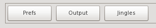
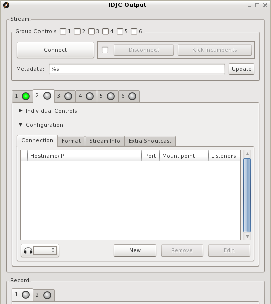

# Configuración servidores en IDJC

## Streaming

IDJC es el operador de la radio que se conecta a un servidor de
[streaming](Glosario.html#Streaming) para hacer la transmisión.

> 

Para configurar el servidor de streaming al que IDJC se conecta
primero hay que conocer los siguientes datos:

-   Servidor de streaming: [http://giss.tv](http://giss.tv)
-   Número de puerto: 8000
-   Punto de montaje (nombre de la radio): /nuestraradio.ogg
-   Nombre de usuario: nuestraradio
-   Contraseña: hackeame

La unión de servidor, puerto y punto de montaje dan la dirección de
la radio:
[http://giss.tv:8000/nuestraradio.ogg](http://giss.tv:8000/nuestraradio.ogg)

### Configuración en IDJC[¶](#Configuración-en-IDJC)

La configuración de servidores de streaming en
[IDJC](Glosario.html#IDJC) se hace en la ventana de "Salidas"
(Output), al que se accede desde la ventana principal de IDJC:

En la ventana de "Salidas" hay seis solapas, cada una representando
la configuración de seis tipos de salidas distintas. Cada una se
configura para un tipo de streaming distinto, por ejemplo para
distintas calidades de salida, y como mínimo deben tener un
servidor de streaming al que conectarse (los demás sirven de
backup). Para agregar un servidor, dentro de la sección
"Configuración" (Configuration), usar el botón "Nuevo" (New):

Dentro de la ventana siguiente se escriben los datos del servidor:

Luego corresponde configurar el formato de salida. Si la colección
de temas se encuentra en diferentes formatos, IDJC lo convierte
todo al formato y calidad seleccionados.

Si bien se pueden seleccionar varios formatos, muchos servidores de
streaming prefieren usar el formato libre [ogg](Glosario.html#Ogg),
porque a diferencia de [mp3](https://es.wikipedia.org/wiki/MP3) no
está
[restringido por patentes](https://es.wikipedia.org/wiki/Vorbis#Historia).
Tanto [FLAC](Glosario.html#FLAC) como Speex son también formatos
libres, uno con mayor calidad y otro orientado a registro de voz,
pero son menos conocidos.

**Importante** A menor calidad, mayor ancho de banda disponible. Si
la conexión es lenta (3G por ejemplo) conviene bajar la calidad de
salida y de muestreo. Las palabras claves son
**[ogg](Glosario.html#Ogg)**,
**[bitrate](Glosario.html#Bitrate-Tasa-de-bits)** y
\***[sample rate](Glosario.html#Sample-rate-Frecuencia-de-muestreo)**.

La configuración debe verse así:

Los círculos de color en cada solapa representan el estado de la
conexión: gris = desconectado, amarillo = conectando, verde =
conectado.

Para conectarse al servidor hay dos opciones:

1.  Conectar cada salida por separado, dentro de la sección
    "Individual controls", clickeando en el botón que tiene la
    dirección de la radio, o
2.  En el encabezado de la ventana, seleccionar el grupo de salidas
    a las que conectarse (Group controls) y presionar el botón Conectar
    (Connect).

**Detalles importantes**:

-   Si bien IDJC puede enviar los datos de los temas que reproduce,
    muchos reproductores tienen problemas para interpretar el cambio de
    datos y la conexión se corta. Para tener una reproducción continua
    hay que dejar el campo Metadatos (Metadata) con un texto fijo, por
    ejemplo el nombre de la radio.

### Reconexión automática[¶](#Reconexión-automática)

Abrir preferencias (prefs) y poner reconexión automática y sin
mostrar el cartel de dialogo.  
  
Lo más cómodo en una trasmisión es que siempre el servidor se
reconecte solo.

### Monitoreo del streaming[¶](#Monitoreo-del-streaming)

Mientras se realiza la transmisión es posible monitorear la calidad
de la conexión y la cantidad de usuarios conectados en la ventana
principal de IDJC, junto a los controles de volumen:

Si la conexión está andando la barra se ve completamente verde. Si
se mueve hacia el rojo significa que la conexión es lenta y hay
retraso. Sólo si el barra se vuelve completamente roja la conexión
se corta e IDJC pregunta si la conexión se quiere reiniciar. Esto
puede pasar porque la conexión efectivamente se cortó, o que hubo
un microcorte que se puede restablecer.

