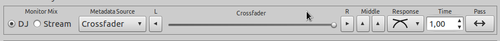
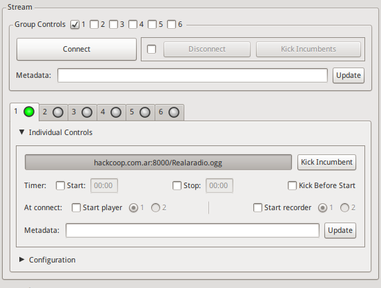
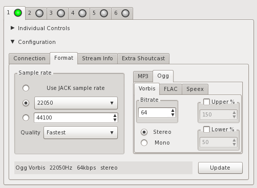

# Manual de uso IDJC

Internet DJ Console es una herramienta poderosa, flexible y dinámica que permite crear programación radial vía Internet.

Es el lugar donde se crea la secuencia musical que se utilizará en el programa. Además, puede tener algunos controles adicionales que 
veremos más adelante. Puedes arrastrar carpetas y/o archivos a esta zona para agregarlos a la lista. Haciendo doble click sobre una 
canción, ésta comenzará a reproducirse.

## Mezclar listas de temas

- **Stream** es el audio de lo que se transmite (al presionar los botones de dos estados “Stream” indicados en el punto anterior se activa o desactiva el audio que sale en la transmisión). 
- **DJ** es otro canal de audio, que permite poder escuchar otra cosa mientras se transmite (al presionar los botones de dos estados “DJ” se activa o desactiva el audio que sale en el modo DJ). 
- El **Metadata Source** colocar en **"None" (Nada)** muchos reproductores no soportarn metadatos.
- El **Crossfader** permite pasar el control de una Lista de temas a otra, de varias maneras: Los botones **L** y **R** pasan de inmediato, sin transición. La **barra del crossfader** permite hacerlo manualmente.

## Control del Micrófono

Este botón activa y desactiva el Micrófono. También puedes activar y desactivar éste control, presionando la tecla "m".

## Configurar la estación (Streaming)

Antes que nada vamos a necesitar un servidor podes conseguir un servidor Icecast en [giss.tv](http://giss.tv/addmount.html).
La configuración de servidores de streaming en **IDJC** se hace en la ventana de **"Salidas" (Output)**, al que se 
accede desde la ventana principal de **IDJC**. Para configurar el servidor de streaming al que **IDJC** se conecta primero hay que 
conocer los siguientes datos:

> **Servidor de streaming:** [http://giss.tv](http://giss.tv)
**Número de puerto:** 8000
**Punto de montaje (nombre de la radio):** /nuestraradio.ogg
**Nombre de usuario:** nuestraradio
**Contraseña:** hackeame

La unión de servidor, puerto y punto de montaje dan la dirección de la radio:
[http://giss.tv:8000/nuestraradio.ogg](http://giss.tv:8000/nuestraradio.ogg)

### Configuración en IDJC

En la ventana de "Salidas" hay seis solapas, cada una representando la configuración de seis 
tipos de salidas distintas. Cada una se configura para un tipo de streaming distinto, por ejemplo para distintas calidades de salida, y 
como mínimo deben tener un servidor de streaming al que conectarse (los demás sirven de respaldo). Para agregar un servidor, dentro de la 
sección **"Configuración" (Configuration)**, usar el botón **"Nuevo" (New)**

> Poner los metadatos en blanco, los reproductores todavia no soportan metadatos en **OGG**

Luego corresponde configurar el formato de salida. Si la colección de temas se encuentra en diferentes formatos, IDJC lo convierte todo 
al formato y calidad seleccionados. 

> Dentro de la ventana siguiente se escriben los datos del servidor.

Si bien se pueden seleccionar varios formatos, muchos servidores de streaming prefieren usar el formato libre OGG, 
porque a diferencia de [mp3](https://es.wikipedia.org/wiki/MP3) no está [restringido por 
patentes](https://es.wikipedia.org/wiki/Vorbis#Historia).

	
**¡Importante!:** a menor calidad, mayor ancho de banda disponible. Si la conexión es lenta (3G por ejemplo) conviene bajar la calidad de 
salida y de muestreo. 

Para comenzar a transmitir presionar el botón **Conectar (Connect)**

## Monitoreo del streaming

Mientras se realiza la transmisión es posible monitorear la calidad de la conexión y la cantidad de usuarios conectados en la ventana 
principal de **IDJC**. Si la conexión está andando la barra se ve completamente verde. Si se mueve hacia el rojo significa que la conexión 
es lenta y hay retraso.

- **gris:** desconectado 
- **rojo:** corto la transmissión
- **amarillo:** conectando
- **verde:** conectado

Algo que podemos hacer para evitar cortes es abrir **preferencias (prefs)** y poner reconexión automática y sin mostrar el cartel de dialogo.

