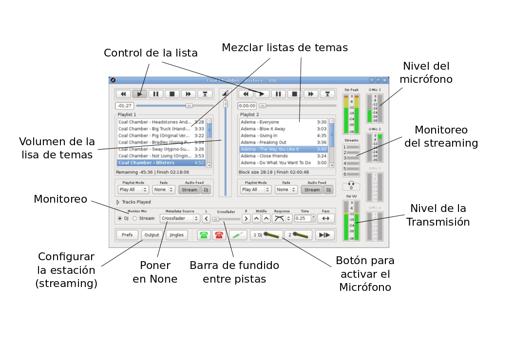
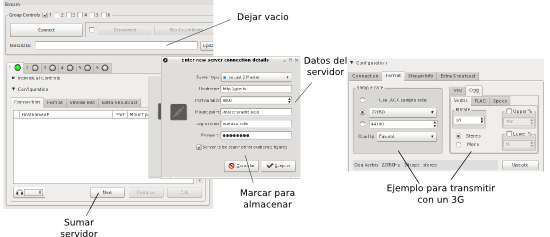

# Manual de uso IDJC

## Instalación

Abrir una consola y poner

<pre>
sudo apt-get update
sudo apt-get install idjc
</pre>

Además, vamos a necesitar un servidor Icecast, podes conseguir un punto de montaje en [giss.tv](http://giss.tv/addmount.html).

## Ventana principal

**Internet DJ Console** es una herramienta poderosa, flexible y dinámica que permite crear programación radial vía Internet. 
En esta pantalla se puede crea la secuencia musical que se utilizará en el programa de radio, activar y desactivar el microfono.

Para agregar música arrastrar carpetas y/o archivos sobre alguna de las listas de reproduccion. 
Haciendo doble click sobre una canción, ésta comenzará a reproducirse.

**Stream** es el audio de lo que se transmite (al presionar los botones de dos estados “Stream” indicados en el punto anterior se activa o desactiva el audio que sale en la transmisión).
**DJ** es otro canal de audio, que permite poder escuchar otra cosa mientras se transmite (al presionar los botones de dos estados “DJ” se activa o desactiva el audio que sale en el modo DJ). 

## Configuración en IDJC

Para agregar un servidor, dentro de la sección **"Configuración" (Configuration)**, usar el botón **"Nuevo" (New)**.
Luego corresponde configurar el formato de salida.

### Configurar la estación (Streaming)

La configuración de servidores de streaming en **IDJC** se hace en la ventana de **"Salidas" (Output)**, al que se accede desde la ventana principal de **IDJC**. 
Para configurar el servidor de streaming al que **IDJC** se conecta primero hay que conocer los siguientes datos:

> - **Servidor de streaming:** http://giss.tv
> - **Número de puerto:** 8000
> - **Punto de montaje (nombre de la radio):** /nuestraradio.ogg
> - **Nombre de usuario:** nuestraradio
> - **Contraseña:** clave

La unión de servidor, puerto y punto de montaje dan la dirección de la radio:
[http://giss.tv:8000/nuestraradio.ogg](http://giss.tv:8000/nuestraradio.ogg)

Poner los metadatos en blanco, los reproductores todavia no soportan metadatos en **OGG**.
Si la colección de temas se encuentra en diferentes formatos, IDJC lo convierte todo al formato y calidad seleccionados.

**¡Importante!:** a menor calidad, mayor ancho de banda disponible. Si la conexión es lenta (**3G** por ejemplo) conviene bajar la calidad de 
salida y de muestreo. 

¡Para comenzar a transmitir presionar el botón **Conectar (Connect)**!

## Monitoreo del streaming

Mientras se realiza la transmisión es posible monitorear la calidad de la conexión y la cantidad de usuarios conectados en la ventana principal de **IDJC**.
Algo que podemos hacer para evitar cortes es abrir **preferencias (prefs)** y poner reconexión automática y sin mostrar el cartel de dialogo.

# Quehaceres

- rehacer el grafico de configuracion
