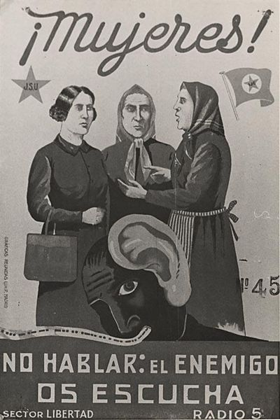

# [Tenemos que hablar de Facebook](http://nadir.org/txt/Tenemos_que_hablar_de_Facebook.html)

Durante varios años, hemos estado proveyendo servidores e infraestructura de comunicación para la izquierda. Hemos hecho todo lo que estaba en nuestras manos para mantener los servidores seguros y hemos resistido, usando varios medios, a peticiones de datos de usuarios por parte de las autoridades.

Siempre hemos visto internet como un recurso para llevar adelante nuestras luchas y al mismo tiempo también como un espacio para el combate político, y hemos actuado en consecuencia con eso. Pensábamos que la mayoría de la izquierda lo veía de la misma manera. Pero desde que más y más gente de la izquierda "usan" Facebook (o Facebook los usa a ellos), ya no estamos tan seguros. Nuestro trabajo político se ha estado viendo como deficiente y agotador. La comunicación cifrada con servidores autónomos no se percibe como algo liberador, sino como algo molesto.

## Disneylandia

No nos habíamos dado cuenta de que después de liberar tanto estrés en las calles y de todas esas largas discusiones en grupo, muchos activistas parecen tener ese deseo de cotorrear sin parar en Facebook sobre cualquier cosa y con cualquiera. No nos habíamos dado cuenta de que, incluso para la izquierda, Facebook es la más dulce de las tentaciones. De que la izquierda, al igual que cualquiera, disfruta siguiendo el sutil flujo de la explotación, que no parece hacer daño y, por una vez, no hace falta resistirse. Mucha gente sufre las malas consecuencias. Aunque esto les puede permitir prever las fatales consecuencias de Facebook, no parece hacerles actuar ante ellas.

## ¿Es realmente ignorancia?

Hagamos un esbozo del problema. Al usar Facebook, los activistas no sólo comunican de forma transparente sus opiniones, sus "me gusta", etc., sino que las dejan disponibles para ser procesadas. No sólo eso (y esto lo consideramos mucho más importante), sino que exponen estructuras y personas que en sí tienen poco o nada que ver con Facebook. La capacidad de Facebook de barrer la web buscando relaciones, similitudes, etc. es difícil de comprender por la gente de a pie. Las luzes hipnotizantes de Facebook acaban haciéndonos reproducir estructuras políticas para las autoridades y las compañías. Toda esta información puede ser buscada, ordenada y agregada no sólo para obtener datos precisos sobre relaciones sociales, personas clave, etc., sino también para hacer predicciones de las cuales se pueden deducir regularidades. Después de los teléfonos móviles, Facebook es la más sutil, barata y mejor tecnología para la vigilancia.

## ¿Son los usuarios de Facebook informantes involuntarios?

Siempre hemos pensado que la izquierda quiere otra cosa: continuar nuestras luchas en internet y utilizar internet para nuestras luchas políticas. De eso se trata para todos nosotros (incluso ahora). Por eso vemos a los usuarios de Facebook como un verdadero peligro para nuestras luchas. En particular, activistas que publican información importante en Facebook (con frecuencia sin saber lo que eso implica), que luego es utilizada cada vez más por las agencias que se dedican a hacer cumplir la ley. Casi podríamos ir más allá y acusar a estos activistas de colaboradores. Pero aun no hemos llegado a ese punto. Todavía tenemos la esperanza de que la gente se de cuenta de que Facebook es un enemigo político y de que aquellos que usan Facebook la hacen más y más poderosa. Los usuarios activistas de Facebook alimentan a la máquina y de este modo revelan nuestras estructuras (sin ninguna necesidad, sin ninguna orden judicial, sin presión alguna).

## Nuestro punto de vista

Somos conscientes de que hablamos desde un punto de vista privilegiado. Para nosotros, habiendo trabajado durante años (y a veces incluso habiéndonos ganado la vida) con la red y los ordenadores, la administración de sistemas, la programación, la criptografía y muchas otras cosas, Facebook se nos presenta como un enemigo natural. Y aunque nos consideramos a nosotros mismos como parte de la izquierda, esto se une al análisis de la política económica de Facebook, donde los "usuarios" son convertidos en producto, que es vendido y eso nos vuelve a convertir finalmente en consumidores. A esto se le llama "generación de demanda". Nos damos cuenta de que no todo el mundo vive los pormenores de internet con el mismo entusiasmo con el que nosotros lo hacemos. Pero el hecho de que haya activistas que dejan a este caballo de Troya llamado Facebook que sea parte de su vida diaria, es un signo del alarmante nivel de ignorancia que existe.

### Urgimos a todo el mundo:

Pon nerviosos a tus compañeros. ¡Déjales claro que alimentando a Facebook han elegido el lado equivocado!
 
* Cierra tu cuenta de Facebook, Yahoo, Google y similares.
* Estás poniendo a otros en peligro
* Actúa en contra del monstruo de los datos
* Por la neutralidad de la red

> ¡Larga vida a la descentralización!
> ¡Libertad para Bradley Manning!
