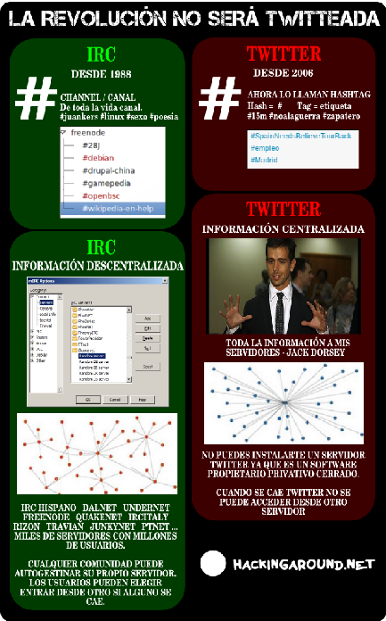

> **Hacking around**
> "Quien nunca ha cometido un error nunca ha probado algo nuevo." @  
> irc.mepone.net  
> http://hackingaround.net

# La revolución no será twitteada

Pues eso, que la revolución no será twitteada ya que twitter es el mal. La revolución twitteada es como decir que vamos a **hacer la 
revolución comiendo caviar del bueno y Atún rojo** sobre un descapotable que consume 7 litros de gasolina cada kilometro.

Twitter es una copia del IRC llevada a la web. Los canales de IRC llevan siempre el símbolo \# (la almohadilla) y después el nombre del 
canal de forma que si quieres hablar en \#19F pues has de entrar en ese canal y conversar con la gente que allí esta charlando. En 
twitter es lo mismo, en tu mensaje indicas \#nombrecanal y tu texto se meterá en un canal.  Lo que cambia es que lo llaman hashtag en 
vez de canal. Otro tipo de adaptaciones del IRC a la web en el pasado han sido los canales de chat de terra y cosas así que en vez de 
llamarlo canal lo mismo lo llamaban habitación.

El IRC permite crear cualquier canal como por ejemplo \#tengoqueiramearahoraregresoysigo y twitter también. **En el IRC un mensaje 
privado se llama "Query"** y en twitter lo llaman DM para ser más molones y poder decir aquello de *"mandame un MDMA de esos"*.La @ 
para nombrar a alguien es una copia también. Los usuarios en las redes IRC tenían sus perfiles y para verlos podías hacerles un whois 
**El problema principal de twitter es que es una red centralizada.** Esto supone que todo el mundo conecta a un mismo sitio donde se va 
almacenando la información y **en caso de que por lo que sea no este disponible ese sitio** (servidores) pues **no podrás 
comunicarte**. Ser centralizada supone que centras la información en los servidores de alguien que controla eso.  En el caso de twitter 
lo controla una empresa. **Una sola empresa controlando millones de conversaciones es un peligro**.

**La descentralización del IRC permite entre otras cosas evitar la censura.** Cuando centralizas algo en un solo punto digamos que si 
eres el gobierno de los Estados unidos y quieres espiar todas las conversaciones solamente has de pagar a una empresa y que te de 
acceso a la base de datos. No es tan complicado comprar a la gente si tienes muchísimo dinero que viene del erario público. **Si en vez 
de centralizar la información se descentraliza estamos poniendo muy difícil las cosas** a quien quiere controlar algo ya que ... todo 
el mundo sabe que la censura sin control no sirve de nada. Primero va el control y después la censura. No solamente han de traficar con 
la información de los usuarios con gobiernos, pueden hacerlo con grandes empresas.

El protocolo IRC es una maravilla y permite que te puedas programar si sabes un cliente IRC o un Servidor IRC. Existen clientes web 
para entrar a un servidor y es en tiempo real. Puedes enviar películas a otro usuario o canciones por DCC.  Tu lista de contactos te 
permite en el IRC enviar mensajes a alguien que leerá después cuando este conectado. Esto en twitter lo llaman notificaciones o 
@connect.

Lo llamaban notificaciones también en el IRC (y lo siguen llamando). En el IRC podías escribir anónimamente o registrarte un usuario. 
En twitter solamente participas si te creas un perfil y lo registras.

**Twitter NO es software libre.** Esto supone que no sabemos realmente como funciona twitter al no saber como esta programado. La 
revolución ha de ser desde herramientas de software libre ya que **la revolución será cifrada **y todo el mundo sabe que de nada sirve 
cifrar si desde por ejemplo el sistema operativo desde el que cifras ya esta comprometido.

Considero pues que **twitter no es revolucionario**. Es algo que no aporta demasiado pero por lo que la gente ha perdido el culo (sobre 
todo la gente que no ha tenido la suerte de perderlo en los 90 con el IRC).

No es casual que existan redes sociales de estas de poner tu foto solamente para gente que conecta al IRC y que sobre IRC existan miles 
de clientes diferentes, modificaciones de clientes, bots de todo tipo (trivial, parchis, frases celebres, ...). En los 90 mucha gente 
hacia quedadas.

El IRC era y es mucho mejor que lo que puede llegar a ser twitter por los motivos indicados en este post. Twitter no es tiempo real, 
IRC si lo es. Twitter guarda todos tus posts, en el IRC tu guardabas los logs si querias y si no querias no. Muchos servidores no 
guardaban log de las conversaciones de la gente.

Twitter puede ser publico o privado, el IRC lo mismo, existen miles de webs donde se puede consultar lo que se dice en el IRC en tiempo 
real. Usar twitter es un error grave que nos esta pasando factura. Es como hablar de que vamos a atracar un banco por teléfono mientras 
la gente de ese banco esta escuchando. Todas las conversaciones de redes sociales como twitter y facebook estan comprometidas por los 
motivos indicados. Existen redes sociales como  [pumpito.mepone.net](http://pumpito.mepone.net)  (pump.io) que si lo son al menos en su 
estructura federada que permite una red distribuida totalmente. Son software libre y una muestra de ello es ese enlace de pumpito donde 
puedes registrate o este otro pumity.net y hablar con gente que esta en otros servidores. Es una maravilla y pump.io aunque esta 
naciendo es muy muy prometedor.

Algunas personas dicen aquello de *"Es que la gente esta en twitter y facebook"* y otras dicen aquello de *"Es que la gente lee el país 
y el ABC"* a pesar de que existen otras redes sociales distintas y otros medios informativos independientes. La gente puede decir por 
tanto misa.

**La revolución no puede ser con medios que se auto-censuran** si han de hablar de Bankia como por ejemplo pasa con el grupo PRISA no 
informando de toqueabankia.net: [http://blogs.tercerainformacion.es/diseccionandoelpais/2013/05/11/sin-noticias-sobre-el- 
toqueabankia-en-el-pais/](http://blogs.tercerainformacion.es/diseccionandoelpais/2013/05/11/sin-noticias-sobre-el-toqueabankia-en-el-pais/)

*"El País prefiere que no cunda el ejemplo de esta guerra de guerrillas contra la banca, y menos aún contra la entidad financiera que 
accedió a extender vencimientos al grupo PRISA por importe de casi 400 millones, hasta los años 2014 y 2015".*

La revolución no puede ser en Twitter y si sobre redes independientes. Es posible usar sus redes con cultura de cifrado. Para ver si un 
medio es independiente no hace falta mucho, con mirar cual es su fuente de financiación es suficiente. ¿Cual es la fuente de 
financiación de twitter? Pues eso. La revolución no puede ser fomentando twitter y su uso, twitter no es revolucionario, twitter es más 
de lo mismo y **twittear la revolución no es posible** **por la simple razón de que si se esta twitteando es que no hemos aprendido 
nada ni cambiado nada**.
