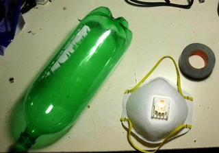
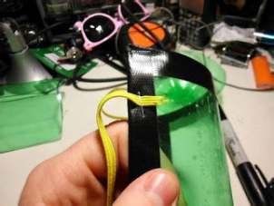
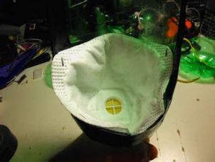
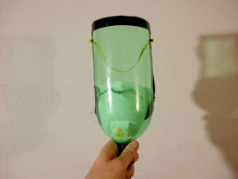
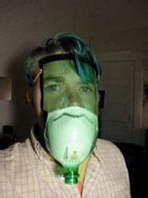

# [Máscara antigas, para las marchas que se vienen](https://blognooficial.wordpress.com/2013/06/16/hagalo-ud-mismo-mascara-antigas-para-las-marchas-que-se-vienen/)

## Material

* Botella PET de 2 litros
* Máscara facial, trapo humedecido con vinagre, jugo de limón o agua con un 5% de bicarbonato.
* Elástico 
* Cinta aisladora

## Pasos

Tiene que estar bien aislado para evitar que entre gas en la máscara, sino puede lastimar los ojos.

> Corte la botella con la forma de su rostro.

> Aisle los bordes con cinta aisladora. Coloque los elásticos de manera que la botella quede firme en el rostro.

> Encastre en la base la máscara facial. 
> Recuerde que, para protegerse del gas lacrímogeno, la alternativa es colocar un trapo humedecido en vinagre.

### Modelo Terminado

*Voilà. Buena Manifestación.*

====

Tomado del blog de [Marcelo Rubens Paiva](http://blogs.estadao.com.br/marcelo-rubens-paiva/faca-voce-mesmo-

La sugerencia es del usuario FRENZY del site [http://www.instructables.com/](http://www.instructables.com/)

Recuerdo de [www.sobrevivendo.com.br](http://www.sobrevivendo.com.br. "http://www.sobrevivendo.com.br ")
